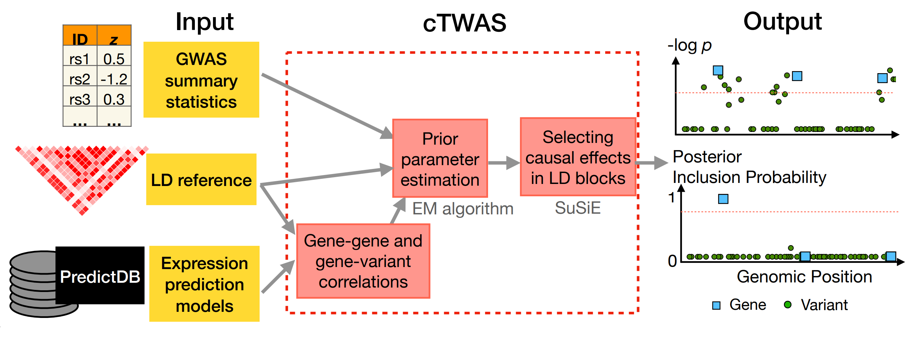

# cTWAS: integrating molecular QTLs and GWAS for gene discovery

[](https://github.com/xinhe-lab/ctwas/actions/workflows/R-CMD-check.yaml)

Expression Quantitative Trait Loci (eQTLs) have often been used to
nominate candidate genes from Genome-wide association studies
(GWAS). However, commonly used methods are susceptible to false
positives largely due to Linkage Disequilibrium of eQTLs with causal
variants acting on the phenotype directly.

Our method, causal-TWAS (cTWAS), addressed this challenge by borrowing ideas from statistical fine-mapping. It is a generalization of Transcriptome-wide association studies (TWAS), but when analyzing any gene, it adjusts for other nearby genes and all nearby genetic variants.

While the [published paper](https://doi.org/10.1038/s41588-023-01648-9) analyzes a single eQTL dataset, the latest version of cTWAS extends the method to integrate multiple groups of prediction models, allowing for joint analysis of multiple types of molecular traits, across potentially different tissues, cell types or conditions.

Running cTWAS involves four main steps: preparing input data, computing gene z-scores, estimating parameters, and fine-mapping. The output of cTWAS are posterior inclusion probabilities (PIPs) for all variants and molecular traits.. 

We have included the following tutorials: 

  * [A minimum tutorial of how to run cTWAS without LD](https://xinhe-lab.github.io/multigroup_ctwas/articles/simple_ctwas_tutorial.html) 

  * To run the full cTWAS, a few more tutorials including:
    
    - [Preparing input data](https://xinhe-lab.github.io/multigroup_ctwas/articles/preparing_ctwas_input_data.html) 

    - [Running cTWAS main function](https://xinhe-lab.github.io/multigroup_ctwas/articles/ctwas_main_function.html)

    - [Running cTWAS by modules](https://xinhe-lab.github.io/multigroup_ctwas/articles/ctwas_modules.html)

    - [Summarizing and visualizing cTWAS results](https://xinhe-lab.github.io/multigroup_ctwas/articles/summarizing_ctwas_results.html)

    - [Post-processing cTWAS results](https://xinhe-lab.github.io/multigroup_ctwas/articles/postprocessing_ctwas_results.html)


You can [browse source code](https://github.com/xinhe-lab/ctwas/tree/multigroup_test) and [report a bug](https://github.com/xinhe-lab/ctwas/issues) here. 



## Install

Install `ctwas`:

```
# install.packages("remotes")
remotes::install_github("xinhe-lab/ctwas",ref = "multigroup_test")
```

Currently, `ctwas` has only been tested on linux systems. 
We recommend running `ctwas` on a High-Performance Computing system.

## Citing this work

If you find the `ctwas` package or any of the source code in this
repository useful for your work, please cite:

> Zhao S, Crouse W, Qian S, Luo K, Stephens M, He X. 
> Adjusting for genetic confounders in transcriptome-wide association 
> studies improves discovery of risk genes of complex traits. 
> Nat Genet (2024). https://doi.org/10.1038/s41588-023-01648-9


## Useful resources

We have pre-computed the LD matrices of European samples from UK Biobank. 
They can be downloaded
[here](https://uchicago.box.com/s/jqocacd2fulskmhoqnasrknbt59x3xkn). 

We have the lists of reference variant information from all the LD
matrices in the genome in
[hg38](https://uchicago.box.com/s/t089or92dkovv0epkrjvxq8r9db9ys99)
and
[hg19](https://uchicago.box.com/s/ufko2gjagcb693dob4khccqubuztb9pz).

cTWAS requires the expression prediction models, or weights, of genes.
The pre-computed weights of GTEx expression and splicing traits can be
downloaded from
[PredictDB](https://predictdb.org/post/2021/07/21/gtex-v8-models-on-eqtl-and-sqtl/).

## Acknowledgement

We acknowledge the authors of `susieR` package for using their codes.

Original `susieR` code obtained by:
```
git clone git@github.com:stephenslab/susieR.git
git checkout c7934c0
```

Minor edits to make it accept different prior variances for each variable.
