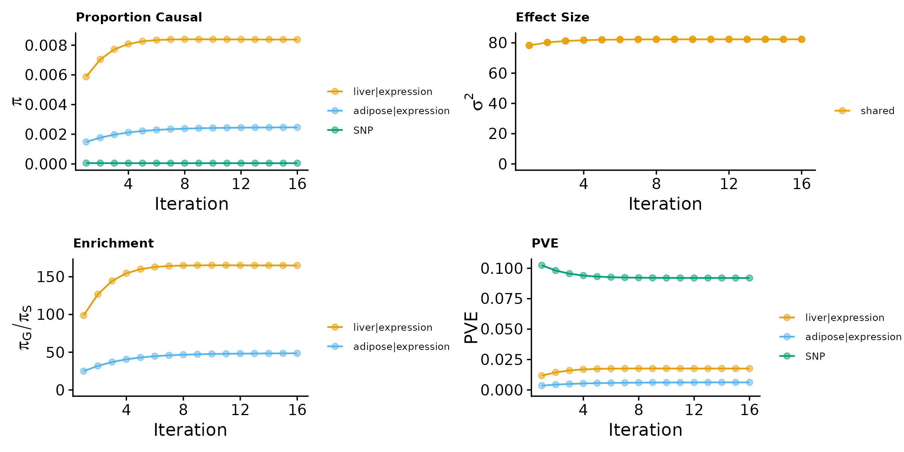
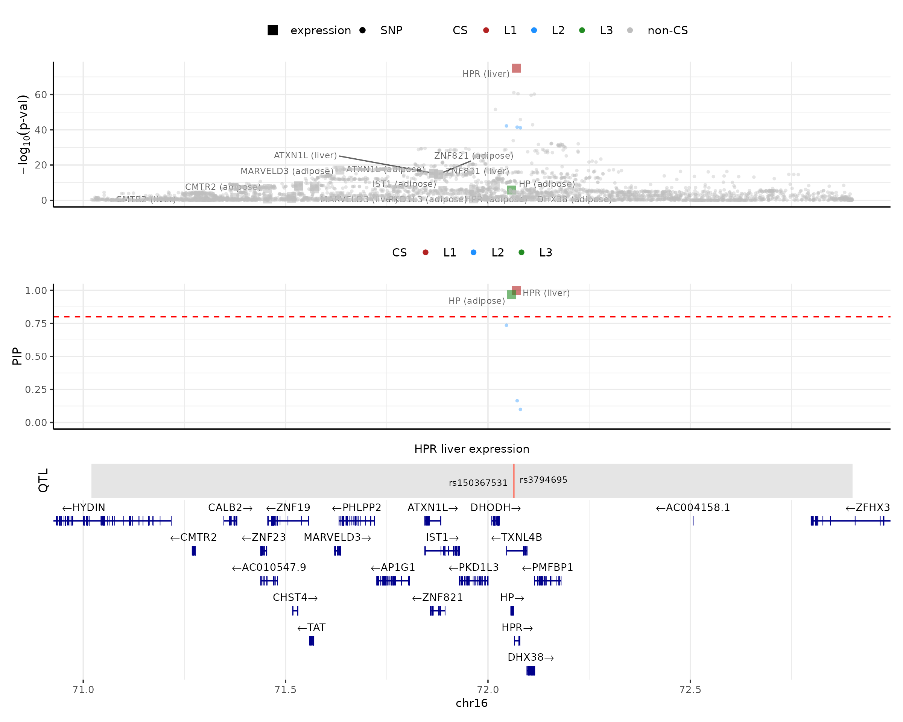
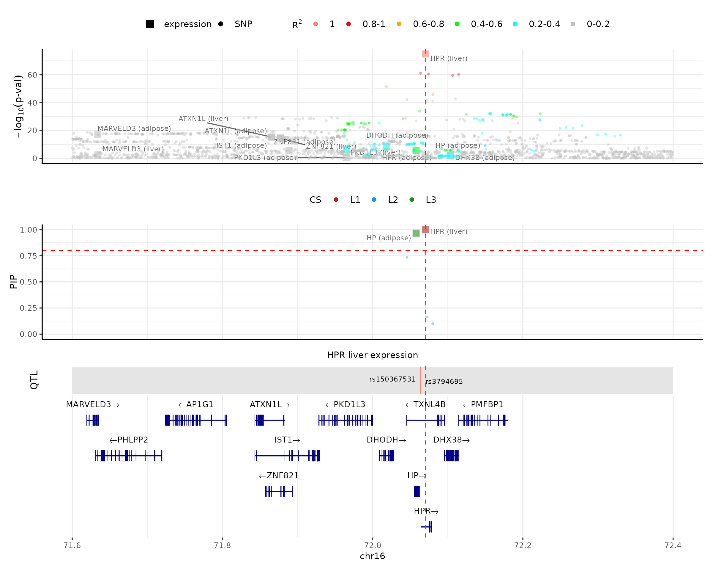
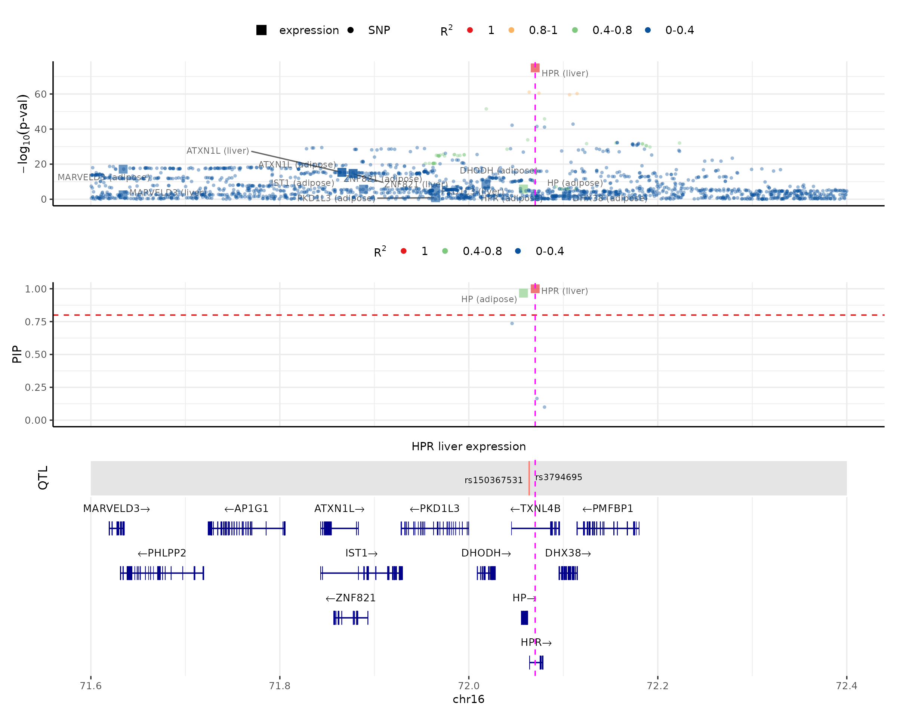

# Summarizing and visualizing cTWAS results

In this tutorial, we will show how to summarize and visualize cTWAS
results.

Load the packages.

``` r
library(ctwas)
library(EnsDb.Hsapiens.v86)
```

We need the Ensembl database `EnsDb.Hsapiens.v86` (for hg38) in this
tutorial, please choose the version of Ensembl database for your
specific data (e.g. `EnsDb.Hsapiens.v75` for hg19).

Let’s first load the cTWAS input data needed to run this tutorial: GWAS
sample size (`gwas_n`), prediction models of molecular traits
(`weights`), the reference data: including information about regions
(`region_info`), reference variant list (`snp_map`) and reference LD
(`LD_map`).

``` r
gwas_n <- 343621

weights <- readRDS(system.file("extdata/sample_data", "LDL_example.preprocessed.weights.RDS", package = "ctwas"))

region_info <- readRDS(system.file("extdata/sample_data", "LDL_example.region_info.RDS", package = "ctwas"))

snp_map <- readRDS(system.file("extdata/sample_data", "LDL_example.snp_map.RDS", package = "ctwas"))

LD_map <- readRDS(system.file("extdata/sample_data", "LDL_example.LD_map.RDS", package = "ctwas"))
```

We then load the cTWAS result for the sample data (chr16) using
parameters estimated from the entire genome.

``` r
ctwas_res <- readRDS(system.file("extdata/sample_data", "LDL_example.ctwas_sumstats_res_param_allchrs.RDS", package = "ctwas"))
z_gene <- ctwas_res$z_gene
param <- ctwas_res$param
finemap_res <- ctwas_res$finemap_res
susie_alpha_res <- ctwas_res$susie_alpha_res
region_data <- ctwas_res$region_data
screen_res <- ctwas_res$screen_res
```

`ctwas_sumstats()` returns several main output:

  - `z_gene`: the Z-scores of molecular traits,

  - `param`: the estimated parameters,

  - `finemap_res`: fine-mapping results, a data frame of molecular
    traits and variants, including their cTWAS IDs (“id”), molecular ID
    (“molecular\_ id”), the regions they belong to (“region\_id”),
    Z-scores (“z”), PIPs (“susie\_pip”), posterior effect size (“mu”),
    credible set indices (“cs\_index”).

The IDs of molecular traits (“id”) used in cTWAS is in the format of
\<molecular\_ id|weight\_name\>. “molecular\_id” are the IDs originally
used in the PredictDB or FUSION weights for genes or other molecular
traits, such as Ensembl gene IDs. `weight_name` is the user defined
weight name when preprocessing weights, see the tutorial [“Preparing
cTWAS input
data”](https://xinhe-lab.github.io/multigroup_ctwas/articles/preparing_input_data.html)).

It also produces other output:

  - `susie_alpha_res`: a data frame with finemapping results of
    molecular traits and the single effect probabilities (alpha) in all
    credible sets. This will be used when computing combined gene PIPs
    below.

  - `region_data`: assembled region data, including Z scores of SNPs and
    molecular traits, for all the regions. Note that only data of the
    subset of SNPs used in screening regions are included.

  - `screen_res`: screening regions results, including the data of all
    SNPs and molecular traits of the selected regions, estimated numbers
    of causal signals (`L`) for selected regions, and a data frame with
    estimated `L` and non-SNP PIPs for all regions.

We focus on examples from running cTWAS with LD here, but the steps
below also mostly work for running without LD.

## Assessing parameters and computing PVE

First, we make plots using the function `make_convergence_plots()` to
see how estimated parameters converge during the execution of the
program:

``` r
make_convergence_plots(param, gwas_n)
```



 

These plots show the estimated prior inclusion probability, prior effect
size variance, enrichment and proportion of variance explained (PVE)
over the iterations of parameter estimation. The enrichment is defined
as the ratio of the prior inclusion probability of molecular traits over
the prior inclusion probability of variants. We generally expect
molecular traits to have higher prior inclusion probability than
variants. Enrichment values typically range from 20 - 200 for expression
traits. We could also plot enrichment at the log scale by setting
`log_enrichment = TRUE`.

Then, we use `summarize_param()` to obtain estimated parameters, test
enrichment, and to compute the PVE by variants and molecular traits.

``` r
ctwas_parameters <- summarize_param(param, gwas_n, enrichment_test = "fisher")
ctwas_parameters
```

    ## $group_size
    ##   liver|expression adipose|expression                SNP 
    ##               8775              10538            7561595 
    ## 
    ## $group_prior
    ##   liver|expression adipose|expression                SNP 
    ##       8.377642e-03       2.464290e-03       5.077222e-05 
    ## 
    ## $group_prior_var
    ##   liver|expression adipose|expression                SNP 
    ##           82.35015           82.35015           82.35015 
    ## 
    ## $log_enrichment
    ##   liver|expression adipose|expression 
    ##           5.105972           3.882310 
    ## 
    ## $log_enrichment_se
    ##   liver|expression adipose|expression 
    ##          0.1268602          0.2025280 
    ## 
    ## $enrichment_pval
    ##   liver|expression adipose|expression 
    ##      2.312433e-131       3.143966e-34 
    ## 
    ## $group_pve
    ##   liver|expression adipose|expression                SNP 
    ##         0.01761788         0.00622350         0.09200771 
    ## 
    ## $total_pve
    ## [1] 0.1158491
    ## 
    ## $prop_heritability
    ##   liver|expression adipose|expression                SNP 
    ##         0.15207611         0.05372075         0.79420314

This function returns several output: `group_prior` are the estimated
prior inclusion probabilities for molecular traits and variants;
`group_prior_var` are estimated prior effect size variance for molecular
traits and variants; `enrichment` are estimated enrichment (at the log
scale) of molecular traits over variants, defined as log ratios of prior
inclusion probabilities. `enrichment_se` are standard errors of the log
enrichment. `enrichment_pval` are the p-values from the enrichment test.
By default, the p-values are computed using Fisher’s exact test
(`enrichment_test = "fisher"`). Alternatively, we could compute p-values
using G-test (`enrichment_test = "G"`).

Other output parameters are related to the proportion of variance
explained (PVE) by molecular traits or variants: `group_pve` are PVE of
molecular traits and variants; `total_pve` is the total PVE from all
molecular traits and variants (sum of `group_pve`) - basically
heritability from all included variables (effectively all common
variants); `prop_heritability` are the proportion of heritability
mediated by molecular traits and variants.

These PVE values allow us to compute how heritability of the phenotype
is partitioned among variants and groups of molecular traits. From our
experience, in single-tissue gene expression analysis, genes typically
explain around 5-15% of the total heritability of the trait. In
multi-group analysis, the heritability of genes could become lower.

## Inspecting and summarizing the cTWAS results

We can add p-values (computed from Z-scores) to the fine-mapping
results.

``` r
finemap_res$pval <- z2p(finemap_res$z)
head(finemap_res)
```

    ##                                    id       molecular_id       type context
    ## 1 ENSG00000189067.12|liver_expression ENSG00000189067.12 expression   liver
    ## 2 ENSG00000153066.12|liver_expression ENSG00000153066.12 expression   liver
    ## 3 ENSG00000122299.11|liver_expression ENSG00000122299.11 expression   liver
    ## 4 ENSG00000171490.12|liver_expression ENSG00000171490.12 expression   liver
    ## 5 ENSG00000103342.12|liver_expression ENSG00000103342.12 expression   liver
    ## 6 ENSG00000048462.10|liver_expression ENSG00000048462.10 expression   liver
    ##              group            region_id          z   susie_pip        mu   cs
    ## 1 liver|expression 16_11426305_12519241  3.7114706 0.092864352 13.480784 <NA>
    ## 2 liver|expression 16_11426305_12519241 -1.1303183 0.004185129 -4.024494 <NA>
    ## 3 liver|expression 16_11426305_12519241 -0.5234426 0.003417769 -2.136369 <NA>
    ## 4 liver|expression 16_11426305_12519241 -0.6835132 0.005295831 -4.753972 <NA>
    ## 5 liver|expression 16_11426305_12519241 -1.1430950 0.004915704 -4.904231 <NA>
    ## 6 liver|expression 16_11426305_12519241  2.3365407 0.055986346 11.730232 <NA>
    ##           pval
    ## 1 0.0002060586
    ## 2 0.2583421381
    ## 3 0.6006663077
    ## 4 0.4942826125
    ## 5 0.2529991581
    ## 6 0.0194630810

We can view the molecular traits above a certain PIP cutoff, e.g. PIP \>
0.8.

``` r
subset(finemap_res, group != "SNP" & susie_pip > 0.8)
```

    ##                                         id      molecular_id       type context
    ## 24626   ENSG00000261701.6|liver_expression ENSG00000261701.6 expression   liver
    ## 24639 ENSG00000257017.8|adipose_expression ENSG00000257017.8 expression adipose
    ##                    group            region_id          z susie_pip         mu
    ## 24626   liver|expression 16_71020125_72901251 -18.403150 1.0000000 -19.441059
    ## 24639 adipose|expression 16_71020125_72901251  -4.810203 0.9665659  -3.921804
    ##       cs         pval
    ## 24626 L1 1.239454e-75
    ## 24639 L3 1.507768e-06

We could further limit the results to molecular traits within credible
sets.

``` r
subset(finemap_res, group != "SNP" & susie_pip > 0.8 & !is.na(cs))
```

    ##                                         id      molecular_id       type context
    ## 24626   ENSG00000261701.6|liver_expression ENSG00000261701.6 expression   liver
    ## 24639 ENSG00000257017.8|adipose_expression ENSG00000257017.8 expression adipose
    ##                    group            region_id          z susie_pip         mu
    ## 24626   liver|expression 16_71020125_72901251 -18.403150 1.0000000 -19.441059
    ## 24639 adipose|expression 16_71020125_72901251  -4.810203 0.9665659  -3.921804
    ##       cs         pval
    ## 24626 L1 1.239454e-75
    ## 24639 L3 1.507768e-06

Below we describe how to aggregate the information from molecular traits
targeting the same genes, to compute the evidence of a gene being causal
(denoted as gene PIPs below). Additionally, we will show how to add
annotations (e.g. gene names and positions) to the cTWAS results that
may be needed in downstream analysis.

### Computing gene PIPs

When we have multiple contexts or different types of molecular traits,
it is useful to evaluate the total evidence of a gene being causal,
*combining evidence of all the molecular traits affecting this gene
across all types and contexts.*

We use the function `combine_gene_pips()` to compute combined PIPs. It
groups molecular traits targeting the same gene (we use `group_by` to
select the column to group molecular traits). It then computes combined
PIPs across contexts (`by = "context"`, default option), types (`by =
"type"`), or both (`by = "group"`).

We have several ways of combining PIPs:

  - “combine\_cs” (default option): it first sums PIPs of molecular
    traits of a genes in each credible set, and then combine PIPs using
    the following formula: \(1 - \prod_{k}(1 - \text{PIP}_{k})\), where
    \(\text{PIP}_{k}\) is the summed PIP of the \(k\)-th credible set of
    a gene.
  - “sum”: sum over PIPs of all molecular traits for the same gene. This
    summation is the expected number of causal molecular traits in this
    gene, and could be higher than 1.

For example, when using gene expression (eQTL) data from multiple
tissues, we can use the function to compute combined PIPs across
contexts, using the “combine\_cs” method. We also report the credible
set information of each molecular trait in the output (`include_cs_id =
TRUE`), which allows us to understand how gene PIPs are obtained.

``` r
combined_pip_by_context <- combine_gene_pips(susie_alpha_res, 
                                             group_by = "molecular_id",
                                             by = "context",
                                             method = "combine_cs",
                                             filter_cs = FALSE,
                                             include_cs_id = TRUE)
```

    ## 2026-09-02 11:04:30 INFO::Compute combined PIPs...

``` r
subset(combined_pip_by_context, combined_pip > 0.8)
```

    ##        molecular_id          combined_cs_id combined_pip
    ## 1 ENSG00000261701.6 16_71020125_72901251.L1    1.0000000
    ## 2 ENSG00000257017.8 16_71020125_72901251.L3    0.9665659
    ##               liver_cs_id liver_pip           adipose_cs_id adipose_pip
    ## 1 16_71020125_72901251.L1         1                          0.00088057
    ## 2                    <NA>        NA 16_71020125_72901251.L3  0.96656592

You could set `filter_cs = TRUE`, if you want to limit the results to
molecular traits within credible sets (default option is `filter_cs =
FALSE`).

In this example, we have gene IDs in the “molecular\_id” column, so we
could use that column to group genes. If the gene IDs are not provided,
we will need to map molecular traits to their target genes in order to
compute gene PIPs, as described below.

### Adding gene annotations to cTWAS results

In the example above, we have Ensembl gene IDs in cTWAS results. It is
often helpful to add additional gene information such as gene names,
gene types (protein coding, non-coding RNAs, etc.) and gene positions.

We have a helper function `get_gene_annot_from_ens_db()`, which extracts
gene annotations from the Ensembl database for a list of genes. It takes
an Ensembl database and a list of Ensembl gene IDs as input, and returns
`gene_annot`, a data frame with gene IDs, gene names, gene types, and
gene positions for the genes.

``` r
ens_db <- EnsDb.Hsapiens.v86
finemap_gene_res <- subset(finemap_res, group != "SNP")
gene_ids <- unique(finemap_gene_res$molecular_id)
gene_annot <- get_gene_annot_from_ens_db(ens_db, gene_ids)
colnames(gene_annot)[colnames(gene_annot) == "gene_id"] <- "molecular_id"
head(gene_annot)
```

    ##         molecular_id gene_name      gene_type chrom    start      end
    ## 1 ENSG00000189067.12     LITAF protein_coding    16 11547722 11636381
    ## 2 ENSG00000153066.12   TXNDC11 protein_coding    16 11679080 11742878
    ## 3 ENSG00000122299.11    ZC3H7A protein_coding    16 11750586 11797267
    ## 4 ENSG00000171490.12    RSL1D1 protein_coding    16 11833850 11851585
    ## 5 ENSG00000103342.12     GSPT1 protein_coding    16 11868128 11916082
    ## 6 ENSG00000048462.10  TNFRSF17 protein_coding    16 11965107 11968068

Note: we used the gene annotations from `EnsDb.Hsapiens.v86` for the
example data in hg38. You should use the Ensembl database for the genome
build of your own data (e.g. `EnsDb.Hsapiens.v75` for hg19).

Basically, `gene_annot` serves as a map between Ensembl gene IDs and the
corresponding genes. Using this map, we could use the function
`anno_finemap_res()` to add additional columns of gene annotations and
positions of genes and variants to the fine-mapping results.

``` r
finemap_res <- anno_finemap_res(finemap_res,
                                snp_map = snp_map,
                                mapping_table = gene_annot,
                                add_gene_annot = TRUE,
                                map_by = "molecular_id",
                                drop_unmapped = TRUE,
                                add_position = TRUE,
                                use_gene_pos = "mid")
```

    ## 2026-09-02 11:04:31 INFO::Annotating fine-mapping result...
    ## 2026-09-02 11:04:31 INFO::Map molecular traits to genes
    ## 2026-09-02 11:04:31 INFO::Add gene positions
    ## 2026-09-02 11:04:31 INFO::Add SNP positions

If `add_gene_annot = TRUE`, it joins the fine-mapping result table
(`finemap_res`) with the `gene_annot` table, by the “molecular ids”
column (set in `map_by`), and adds additional columns of gene
annotations to the fine-mapping results By default, we drop the genes
not found in `gene_annot` (`drop_unmapped = TRUE`). If `add_position =
TRUE`, it adds positional information to the fine-mapping results. The
positional information of variants can be found in the data structure of
reference SNPs: `snp_map`. The users need to provide positional
information of molecular traits, through `mapping_table`. In our
example, we use `gene_annot`, which has gene positions. By default, we
will use the midpoint positions for genes. You could also use “start” or
“end” positions by setting the `use_gene_pos` argument.

With the added gene information, we could limit results to protein
coding genes, and view the prioritized genes with additional
information:

``` r
subset(finemap_res, group != "SNP" & gene_type == "protein_coding" & susie_pip > 0.8 & !is.na(cs))
```

    ##                                       id      molecular_id       type context
    ## 215   ENSG00000261701.6|liver_expression ENSG00000261701.6 expression   liver
    ## 228 ENSG00000257017.8|adipose_expression ENSG00000257017.8 expression adipose
    ##                  group            region_id          z susie_pip         mu cs
    ## 215   liver|expression 16_71020125_72901251 -18.403150 1.0000000 -19.441059 L1
    ## 228 adipose|expression 16_71020125_72901251  -4.810203 0.9665659  -3.921804 L3
    ##             pval gene_name      gene_type chrom    start      end      pos
    ## 215 1.239454e-75       HPR protein_coding    16 72063224 72077246 72070235
    ## 228 1.507768e-06        HP protein_coding    16 72054592 72061055 72057824

### Integrating multiple types of molecular traits

For more complex settings that involve different types of molecular
traits, we will need to map molecular traits to their corresponding
genes in order to compute gene PIPs.

To map molecular traits to their corresponding genes, we need a data
frame `mapping_table`, with IDs of molecular traits (“molecular\_id”),
and the corresponding gene names (“gene\_name”). It is helpful to
include additional gene information, such as gene types and gene
positions. We provide a `mapping_table` to map introns to genes for
PredictDB expression and slicing data
[here](https://uchicago.box.com/s/gx7raqf5c9jp6tgvm5tpc2ej7zr6bnxz). The
mapping file is also available on UChicago RCC server:
`/project2/xinhe/shared_data/multigroup_ctwas/weights/mapping_files/PredictDB_mapping.RDS`.

For example:

``` r
mapping_table <- readRDS("/project2/xinhe/shared_data/multigroup_ctwas/weights/mapping_files/PredictDB_mapping.RDS")

head(mapping_table[mapping_table$gene_name == "UBR1",])
```

    ##                       molecular_id gene_name      gene_type chrom    start
    ## 310222          ENSG00000159459.11      UBR1 protein_coding    15 42942897
    ## 173881 intron_15_43038232_43043215      UBR1 protein_coding    15 43038232
    ## 173882 intron_15_43043395_43047161      UBR1 protein_coding    15 43043395
    ## 173883 intron_15_43047289_43048392      UBR1 protein_coding    15 43047289
    ## 173884 intron_15_43048491_43054742      UBR1 protein_coding    15 43048491
    ## 173885 intron_15_43054899_43056344      UBR1 protein_coding    15 43054899
    ##             end
    ## 310222 43106113
    ## 173881 43043215
    ## 173882 43047161
    ## 173883 43048392
    ## 173884 43054742
    ## 173885 43056344

Using this mapping table, we can use the `anno_finemap_res()` function
to add additional columns to the fine-mapping results. If a molecular
trait is mapped to multiple genes, it splits the PIP of that molecular
trait to its target genes. In this example, we use `gene_annot` as the
mapping table between expression traits and the corresponding gene
names.

``` r
mapping_table <- gene_annot
finemap_res <- anno_finemap_res(finemap_res,
                                snp_map = snp_map,
                                mapping_table = mapping_table,
                                add_gene_annot = TRUE,
                                map_by = "molecular_id",
                                drop_unmapped = TRUE,
                                add_position = TRUE,
                                use_gene_pos = "mid")
```

We use the `combine_gene_pips()` function to compute gene PIPs across
different types of molecular traits. Here we use `group_by =
"gene_name"`, because molecular traits are mapped to their corresponding
genes by the “gene\_name” column in `mapping_table`.

``` r
combined_pip_by_type <- combine_gene_pips(susie_alpha_res,
                                          mapping_table = mapping_table,
                                          group_by = "gene_name",
                                          by = "type",
                                          method = "combine_cs",
                                          filter_cs = FALSE,
                                          include_cs_id = TRUE)
```

    ## 2026-09-02 11:04:35 INFO::Compute combined PIPs...
    ## 2026-09-02 11:04:35 INFO::Annotating susie alpha result...
    ## 2026-09-02 11:04:35 INFO::Map molecular traits to genes.

``` r
subset(combined_pip_by_type, combined_pip > 0.8)
```

    ##   gene_name          combined_cs_id combined_pip        expression_cs_id
    ## 1       HPR 16_71020125_72901251.L1    1.0000000 16_71020125_72901251.L1
    ## 2        HP 16_71020125_72901251.L3    0.9665659 16_71020125_72901251.L3
    ##   expression_pip
    ## 1      1.0000000
    ## 2      0.9665659

## Visualizing the cTWAS results

It is often useful to visualize the results of cTWAS. This would help
one understand the rationale of how cTWAS chooses a particular molecular
trait and identify issues when cTWAS doesn’t behave properly.

We make locus plots to visualize the association of variants and
molecular traits, cTWAS PIP results, and other information, such as QTLs
and gene annotations. We illustrate this with an example below.

We use the `make_locusplot()` function to make locus plots for regions
of interest. We need the fine-mapping result with position information,
region ID, Ensembl gene annotation database (`ens_db`) for plotting the
gene track, and optionally, preprocessed weights (`weights`) for
plotting the QTL track.

``` r
make_locusplot(finemap_res,
               region_id = "16_71020125_72901251",
               ens_db = ens_db,
               weights = weights,
               highlight_pip = 0.8,
               filter_protein_coding_genes = TRUE,
               filter_cs = TRUE,
               color_pval_by = "cs",
               color_pip_by = "cs")
```

    ## 2026-09-02 11:04:36 INFO::Limit to protein coding genes
    ## 2026-09-02 11:04:36 INFO::focal id: ENSG00000261701.6|liver_expression
    ## 2026-09-02 11:04:36 INFO::focal molecular trait: HPR liver expression
    ## 2026-09-02 11:04:36 INFO::Range of locus: chr16:71020348-72900542
    ## 2026-09-02 11:04:36 INFO::focal molecular trait QTL positions: 72063820,72063928
    ## 2026-09-02 11:04:36 INFO::Limit PIPs to credible sets



 

The locus plot shows several tracks in the example region. The top one
shows -log10(p-value) of the association of variants (from GWAS) and
molecular traits (from the package computed z-scores) with the
phenotype. The next track shows the PIPs of variants and molecular
traits. By default, we limit PIP results to credible sets in the PIP
track (`filter_cs = TRUE`). The next track shows the QTLs of the focal
gene. By default, it chooses the molecular trait with the highest PIP
(“HPR” in this case). We could specify the focal gene by setting the
`focal_id` to the “ID” of interest, or `focal_gene` to the gene name of
interest. If there are multiple molecular traits or contexts of the
focal gene, it will automatically use the one with the highest PIP. The
bottom is the gene track. We limit results to protein coding genes by
default. We can draw a red dotted line to show the PIP cutoff of 0.8 by
setting `highlight_pip = 0.8`.

There are a few ways to color the data points in the p-value and PIP
tracks, by setting `color_pval_by` and `color_pip_by` options. “cs”
would color the data points by credible sets (default option); “LD”
would color data points by correlations with the focal gene; “none”
would use the same colors for all data points, except for the focal
gene.

To color data points by correlations with the focal gene, We need
correlation matrices among molecular traits and SNPs. If we have saved
correlation matrices in `cor_dir` when running cTWAS with LD, we could
simply load those precomputed correlation matrices of the region using
the function `load_region_cor()`.

``` r
region_id <- "16_71020125_72901251"
cor_dir <- system.file("extdata/sample_data", "cor_matrix", package = "ctwas")
cor_res <- load_region_cor(region_id, cor_dir = cor_dir)
```

If we don’t have precomputed correlation matrices, we could compute the
correlation matrices of the region using the function
`get_region_cor()`. We will need the region data with all SNPs
(`screened_region_data`), `LD_map` and `weights`.

``` r
screened_region_data <- screen_res$screened_region_data
region_id <- "16_71020125_72901251"
cor_res <- get_region_cor(region_id,
                          sids = screened_region_data[[region_id]]$sid,
                          gids = screened_region_data[[region_id]]$gid,
                          LD_map = LD_map,
                          weights = weights)
```

The locus plot above shows the whole region. We could zoom in a region
of interest by specifying the `locus_range` argument. In the example
below, we zoom in the region, color the p-value track by correlations
with the focal gene, and color the PIP track by credible sets. We could
also highlight positions of interest by setting `highlight_pos`, for
example, we highlight the position of HPR gene below.

``` r
make_locusplot(finemap_res,
               region_id = "16_71020125_72901251",
               ens_db = ens_db, 
               weights = weights,
               locus_range = c(71.6e6,72.4e6),
               highlight_pip = 0.8,
               highlight_pos = 72070235,
               R_snp_gene = cor_res$R_snp_gene,
               R_gene = cor_res$R_gene,
               filter_protein_coding_genes = TRUE,
               filter_cs = TRUE,
               color_pval_by = "LD",
               color_pip_by = "cs")
```

    ## 2026-09-02 11:04:42 INFO::Limit to protein coding genes
    ## 2026-09-02 11:04:42 INFO::focal id: ENSG00000261701.6|liver_expression
    ## 2026-09-02 11:04:42 INFO::focal molecular trait: HPR liver expression
    ## 2026-09-02 11:04:42 INFO::Range of locus: chr16:71600000-72400000
    ## 2026-09-02 11:04:42 INFO::focal molecular trait QTL positions: 72063820,72063928
    ## 2026-09-02 11:04:42 INFO::Limit PIPs to credible sets
    ## 2026-09-02 11:04:42 INFO::highlight positions: 72070235



 

In this plot, one can see that there are several genes with good
associations with the phenotype (top panel), but only HPR in liver is
prioritized by cTWAS (second panel). This suggests that other
associations are likely due to their correlations with the prioritized
genes rather than representing independent signals.

We can also color by LD in both p-val and PIP panels, and customize the
LD intervals (`LD.breaks`) and colors (`LD.colors`) if needed. For
example:

``` r
make_locusplot(finemap_res,
               region_id = "16_71020125_72901251",
               ens_db = ens_db, 
               weights = weights,
               locus_range = c(71.6e6,72.4e6),
               LD.breaks = c(0, 0.4, 0.8, 1),
               LD.colors = c("#08519c", "#7fc97f", "#fdb462", "#e41a1c"),
               highlight_pip = 0.8,
               highlight_pos = 72070235,
               R_snp_gene = cor_res$R_snp_gene,
               R_gene = cor_res$R_gene,
               filter_protein_coding_genes = TRUE,
               filter_cs = TRUE,
               color_pval_by = "LD",
               color_pip_by = "LD")
```

    ## 2026-09-02 11:04:45 INFO::Limit to protein coding genes
    ## 2026-09-02 11:04:45 INFO::focal id: ENSG00000261701.6|liver_expression
    ## 2026-09-02 11:04:45 INFO::focal molecular trait: HPR liver expression
    ## 2026-09-02 11:04:45 INFO::Range of locus: chr16:71600000-72400000
    ## 2026-09-02 11:04:45 INFO::focal molecular trait QTL positions: 72063820,72063928
    ## 2026-09-02 11:04:45 INFO::Limit PIPs to credible sets
    ## 2026-09-02 11:04:45 INFO::highlight positions: 72070235



 

For the “no-LD” version, we could still make the locus plot. The
difference is that it could not color the data points by correlations
with the focal gene.

## Sample report of the cTWAS results

We present a [sample cTWAS
report](https://xinhe-lab.github.io/multigroup_ctwas/articles/sample_report.html)
based on real data analysis. The analyzed trait is LDL cholesterol, the
prediction models are liver gene expression and splicing models trained
on GTEx v8 in the PredictDB format.
